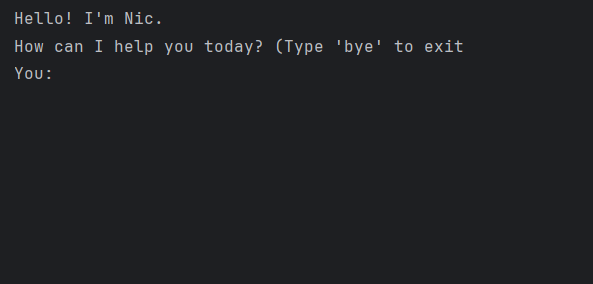

# Nic User Guide




Nic is a chatbot that can help you keep track of your tasks and stores it for you in a data folder.
In the formats below, ellipsis means non-empty values,

## Adding Todos

Adds a new todo in your task list

Format: `todo ...` 

Example: `todo read`

```
____________________________________________________________
Got it. I've added the task:
 [T][ ] read
Now you have 7 tasks in the list.
____________________________________________________________
```

## Adding Deadline

Adds a new deadline in your task list

Format: `deadline ... /by ...`

Example: `deadline volleyball /by friday`

```
____________________________________________________________
Got it. I've added the task:
 [D][ ] volleyball (by: friday)
Now you have 9 tasks in the list.
____________________________________________________________

```

## Adding Event

Adds a new event in your task list

Format: `event ... /from ... /to ...`

Example: `event concert /from Jan 05 4pm /to 6pm`

```
____________________________________________________________
Got it. I've added the task:
 [E][ ] concert (from: jan 05 4pm to: 6pm)
Now you have 8 tasks in the list.
____________________________________________________________

```

## List

Lists all tasks in your task list

Format: `list`

Example: `list`

```
Here are the tasks in your list:
1. [T][ ] study
2. [T][ ] study
3. [D][ ] do this (by: tonight)
4. [T][X] rest
5. [T][ ] think
6. [D][ ] project (by: friday)
7. [T][ ] project
____________________________________________________________

```

## Marking task

Marks the task in your task list as done

Format: `mark index`, index refers to the number of the task in the list

Example: `mark 2`

```
____________________________________________________________
Nice! I've marked this task as done:
 [T][X] study
____________________________________________________________

```

## Unmarking task

Marks the task in your task list as undone

Format: `mark index`, index refers to the number of the task in the list

Example: `unmark 2`

```
____________________________________________________________
OK, I've marked this task as not done yet:
 [T][ ] study
____________________________________________________________

```

## Delete task

Deletes the task from your task list

Format: `delete index`, index refers to the number of the task in the list

Example: `delete 2`

```
____________________________________________________________
Noted. I've removed this task:
  [T][ ] study
Now you have 8 tasks in the list.
____________________________________________________________

```

## Find task

Finds all tasks in your task lists containing a keyword

Format: `find keyword`

Example: `find sleep`

```
No matching tasks found.

```

## Exit

Exits chatbot

Format: `bye`

Example: `bye`

```
Nic: Hope I was able to help you, goodbye!

```